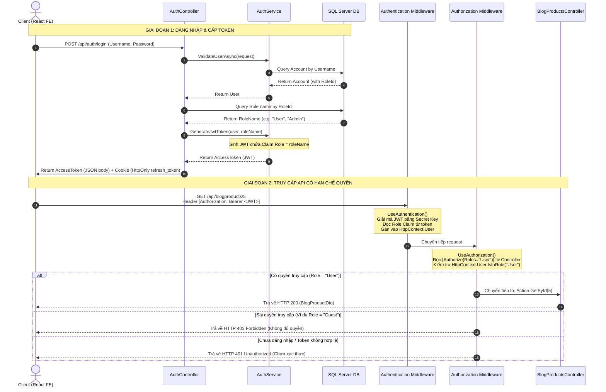

# Hướng Dẫn Luồng Xác Thực & Phân Quyền (Auth & Authorization Flow)

Tài liệu này giải thích chi tiết quy trình hoạt động từ lúc người dùng đăng nhập, hệ thống sinh mã JWT Token cho tới khi các Middleware của ASP.NET Core kiểm tra quyền hạn để cho phép hoặc từ chối truy cập vào một API được bảo vệ (ví dụ: `GET api/blogproducts/5`).

---

## 1. Sơ Đồ Quy Trình Tổng Quan (Sequence Diagram)

Quy trình này được chia làm 2 giai đoạn chính: **Giai đoạn Đăng nhập (Sinh Token)** và **Giai đoạn Gọi API được bảo vệ (Xác thực & Phân quyền)**.



---

## 2. Chi Tiết Từng Bước Hoạt Động

### Bước 1: Client gửi yêu cầu đăng nhập
Client (React) gửi `POST` request chứa tài khoản mật khẩu lên endpoint `/api/auth/login`.

### Bước 2: Backend xác thực và lấy thông tin Account
`AuthController` gọi `AuthService.ValidateUserAsync`. Tại đây, dịch vụ sẽ tìm tài khoản khách hàng dưới Database qua Username, so khớp mật khẩu đã được băm. Nếu đúng sẽ trả về thông tin tài khoản (trong đó có cột `RoleId`).

### Bước 3: Truy vấn Role động từ Database
`AuthController` thực hiện một câu lệnh truy vấn trực tiếp bảng `Role` theo ID:
```csharp
var role = await _context.Roles.FirstOrDefaultAsync(r => r.Id == user.RoleId);
var roleName = role?.Name ?? "User"; // Lấy ra chuỗi ví dụ: "Admin" hoặc "User"
```

### Bước 4: Tạo JWT Token chứa Claim Role
`AuthService.GenerateJwtToken` được gọi để tạo ra mã Access Token. Ở đây, ta nạp các thông tin định danh (Claims) vào token:
```csharp
var claims = new List<Claim>
{
    new Claim(ClaimTypes.NameIdentifier, account.Id.ToString()),
    new Claim(ClaimTypes.Name, account.FullName ?? string.Empty),
    new Claim(ClaimTypes.Email, account.Email ?? string.Empty),
    new Claim(ClaimTypes.Role, roleName) // <--- CỰC KỲ QUAN TRỌNG: Claims chứa quyền hạn của User
};
```
JWT sau đó được ký số bằng thuật toán HMAC-SHA256 với khóa bí mật (`Jwt:Key`).

### Bước 5: Trả Token về cho Client
* **Access Token (JWT):** Trả về trong JSON Body để React lưu vào bộ nhớ RAM.
* **Refresh Token:** Lưu dưới DB và set vào HttpOnly Cookie để bảo vệ trước mã độc XSS.

---

## 3. Cách Middleware Xử Lý Khi Gọi API Được Bảo Vệ

Khi Front-end gửi request tới một API có gắn thuộc tính bảo vệ (Ví dụ: `[Authorize(Roles = "User")]`), request phải đính kèm Header `Authorization: Bearer <Token>`.

Request sẽ đi qua đường ống (Middleware Pipeline) trong `Program.cs` theo thứ tự sau:

### 1. `app.UseAuthentication()` (Xác thực người dùng)
* Middleware này bắt được Header `Authorization`.
* Nó dùng khóa bí mật `Jwt:Key` trên Server để kiểm duyệt chữ ký của Token.
* Nếu Token chính chủ và còn hạn, nó sẽ trích xuất danh sách Claims ra và nạp vào đối tượng `ClaimsPrincipal`.
* Cuối cùng, nó gán thực thể này vào `HttpContext.User` của request hiện tại. 

### 2. `app.UseAuthorization()` (Phân quyền truy cập)
* Middleware này chạy ngay sau bước xác thực.
* Khi thấy Endpoint đích có gắn `[Authorize(Roles = "User")]`, nó sẽ kiểm tra thuộc tính `HttpContext.User`.
* Nó gọi lệnh `HttpContext.User.IsInRole("User")` (lệnh này duyệt qua các claim đã giải mã để tìm claim mang tên `http://schemas.microsoft.com/ws/2008/06/identity/claims/role` xem có khớp với `"User"` không).
* **Kết quả:**
  * Khớp $\rightarrow$ Cho phép chạy tiếp vào Controller.
  * Sai Role $\rightarrow$ Trả thẳng về HTTP Status Code **`403 Forbidden`**.
  * Token sai/hết hạn/không có token $\rightarrow$ Trả thẳng về HTTP Status Code **`401 Unauthorized`**.

---

## 4. Cách Sử Dụng Trong Controller

Để áp dụng cơ chế này, bạn chỉ cần sử dụng attribute `[Authorize]` trên Controller hoặc từng Action của API:

```csharp
using Microsoft.AspNetCore.Authorization;
using Microsoft.AspNetCore.Mvc;

[ApiController]
[Route("api/[controller]")]
public class BlogProductsController : ControllerBase
{
    // Bất kỳ ai đã đăng nhập (Role bất kỳ) đều gọi được
    [Authorize]
    [HttpGet]
    public async Task<IActionResult> GetAll() { ... }

    // Chỉ tài khoản có Role là "User" hoặc "Admin" trong DB mới gọi được
    [Authorize(Roles = "Admin,User")]
    [HttpGet("{id}")]
    public async Task<IActionResult> GetById(int id) { ... }

    // Chỉ tài khoản có Role là "Admin" mới được phép xóa sản phẩm
    [Authorize(Roles = "Admin")]
    [HttpDelete("{id}")]
    public async Task<IActionResult> Delete(int id) { ... }
}
```
