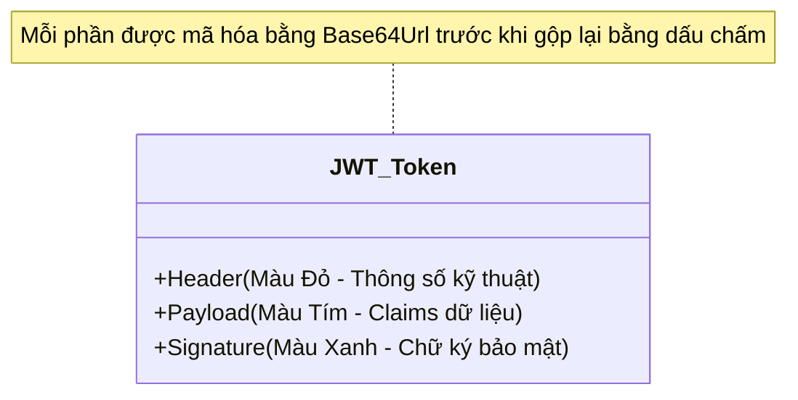
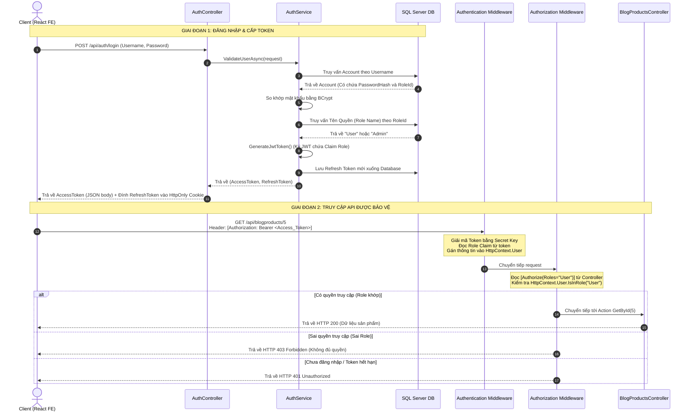

# SỔ TAY TOÀN TẬP: XÁC THỰC (AUTH) & JWT TOKEN TRONG ASP.NET CORE

> Tài liệu này tổng hợp toàn bộ lý thuyết, sơ đồ luồng chạy thực tế, cấu trúc JWT, Refresh Token và các phương thức triển khai bảo mật xác thực trong dự án **Artify eCommerce**.

---

## 📅 MỤC LỤC
1. [Phần 1: Xác thực là gì? (Ẩn dụ "Vé xem phim")](#phần-1-xác-thực-là-gì-ẩn-dụ-vé-xem-phim)
2. [Phần 2: Mã hóa mật khẩu với BCrypt](#phần-2-mã-hóa-mật-khẩu-với-bcrypt)
3. [Phần 3: Cấu trúc 3 phần của JWT (JSON Web Token)](#phần-3-cấu-trúc-3-phần-của-jwt-json-web-token)
4. [Phần 4: Access Token vs Refresh Token](#phần-4-access-token-vs-refresh-token)
5. [Phần 5: Sơ đồ luồng chạy Auth chi tiết (Sequence Diagram)](#phần-5-sơ-đồ-luồng-chạy-auth-chi-tiết-sequence-diagram)
6. [Phần 6: Cách Middleware xử lý khi gọi API được bảo vệ](#phần-6-cách-middleware-xử-lý-khi-gọi-api-được-bảo-vệ)
7. [Phần 7: Cấu hình bảo mật nâng cao (CORS & Cookie HttpOnly)](#phần-7-cấu-hình-bảo-mật-nâng-cao-cors--cookie-httponly)

---

## PHẦN 1: XÁC THỰC LÀ GÌ? (ẨN DỤ "VÉ XEM PHIM")

Để hiểu tại sao các hệ thống Web API hiện đại lại dùng JWT thay cho Session truyền thống, hãy so sánh với cách đi xem phim tại rạp:

| Hành động | Tương ứng trong Web API | Cách thức hoạt động |
| :--- | :--- | :--- |
| **Mua vé tại quầy** | **API Đăng nhập (Login)** | Bạn trình chứng minh thư (Username/Password), nhân viên kiểm tra dữ liệu và in cho bạn một **Tấm vé xem phim (JWT Token)**. |
| **Cầm vé đi vào phòng chiếu** | **Gửi kèm Token trong Request Header** | Mỗi lần bạn muốn vào phòng chiếu (gọi API cần bảo mật như xem giỏ hàng, thanh toán), bạn chỉ cần đưa **Tấm vé** ra cho bảo vệ (Middleware). |
| **Bảo vệ kiểm tra vé** | **Xác thực Token (Authentication)** | Bảo vệ nhìn vào dấu mộc và chữ ký của rạp phim trên vé (Chữ ký mật mã `Signature`). Nếu đúng dấu mộc, bạn được vào phòng chiếu mà không cần nhân viên phải chạy về kho để lục lại CMT của bạn nữa. |

---

## PHẦN 2: MÃ HÓA MẬT KHẨU VỚI BCRYPT

### Tại sao không bao giờ được lưu mật khẩu dạng chữ thường (Plain Text)?
Nếu Database bị rò rỉ, toàn bộ tài khoản người dùng sẽ bị lộ. Do đó, trước khi lưu xuống DB, ta phải **Băm (Hash)** mật khẩu thành một chuỗi ký tự kỳ dị không thể dịch ngược lại được.

### Tại sao chọn thuật toán BCrypt?
BCrypt tự động tích hợp thêm một chuỗi **Salt (Muối)** ngẫu nhiên vào chuỗi hash. Kể cả hai người dùng đặt mật khẩu giống hệt nhau là `123456`, chuỗi Hash lưu dưới DB của họ vẫn hoàn toàn khác nhau. Điều này ngăn chặn việc hacker dùng các bảng tra cứu mật khẩu có sẵn để giải mã ngược.

---

## PHẦN 3: CẤU TRÚC 3 PHẦN CỦA JWT (JSON WEB TOKEN)

Một chuỗi JWT gồm 3 đoạn văn bản được ngăn cách nhau bởi 2 dấu chấm (`.`): `xxxxx.yyyyy.zzzzz`



### 1. Header (Phần Đầu)
Chứa kiểu token (mặc định là JWT) và thuật toán mã hóa được sử dụng để ký (ví dụ: HS256).
```json
{
  "alg": "HS256",
  "typ": "JWT"
}
```

### 2. Payload (Phần Thân - Chứa các Claims)
Claims là các cặp Key-Value lưu thông tin định danh của người dùng (User):
```json
{
  "nameid": "12",
  "unique_name": "admin",
  "role": "Admin",
  "exp": 1719333600
}
```
*   ⚠️ **LƯU Ý CỰC KỲ QUAN TRỌNG:** Phần Payload này chỉ được mã hóa dạng **Base64** chứ không được che giấu bí mật. Bất kỳ ai cũng có thể giải mã phần này dễ dàng bằng các công cụ online như `jwt.io`. **Vì vậy, tuyệt đối không để các thông tin nhạy cảm như Mật khẩu, Số thẻ ngân hàng vào Payload!**

### 3. Signature (Phần Chữ ký)
Dùng để xác thực tính toàn vẹn của token (chống hacker sửa đổi dữ liệu).
Nó được tạo ra bằng thuật toán băm:
```text
HMACSHA256(Base64Url(Header) + "." + Base64Url(Payload), SecretKey)
```
Nếu hacker cố tình sửa tên user trong phần Payload từ `"customer"` thành `"admin"` để chiếm quyền, chữ ký được tính toán lại sẽ không khớp với chữ ký ban đầu của Server (vì hacker không biết `Secret Key` được giấu kín trên Server). API sẽ phát hiện giả mạo và từ chối xử lý (trả về lỗi HTTP 401).

---

## PHẦN 4: ACCESS TOKEN VS REFRESH TOKEN

| Đặc điểm | Access Token (JWT) | Refresh Token |
| :--- | :--- | :--- |
| **Bản chất** | Chuỗi JWT ngắn hạn (thường sống từ 5 - 15 phút). | Chuỗi ngẫu nhiên dài hạn (thường sống từ 7 - 30 ngày). |
| **Nơi lưu trữ** | Frontend lưu ở bộ nhớ tạm (RAM). Gửi kèm mỗi request qua Header `Authorization: Bearer <token>`. | Lưu dưới Database của Server và đính kèm vào Cookie (HttpOnly) của Client. |
| **Cách Server kiểm tra** | **Stateless**: Giải mã toán học tại chỗ bằng Secret Key để kiểm tra hạn dùng và chữ ký. **Không cần truy vấn Database**. | **Stateful**: Nhận từ Cookie và thực hiện **truy vấn Database** để tìm dòng tương ứng xem có trùng khớp và còn hiệu lực không. |
| **Mục đích chính** | Dùng để xác thực và phân quyền nhanh chóng khi gọi các API bảo mật. | Chỉ dùng để đổi lấy một Access Token mới khi Access Token cũ hết hạn (giúp người dùng không phải đăng nhập lại). |

---

## PHẦN 5: SƠ ĐỒ LUỒNG CHẠY AUTH CHI TIẾT (SEQUENCE DIAGRAM)

Quy trình này gồm 2 giai đoạn: **Đăng nhập & Cấp Token** và **Truy cập API được bảo vệ**.



---

## PHẦN 6: CÁCH MIDDLEWARE XỬ LÝ KHI GỌI API ĐƯỢC BẢO VỆ

Khi request đi qua đường ống (Middleware Pipeline) cấu hình trong `Program.cs`, hai mắt xích sau sẽ xử lý xác thực:

### 1. `app.UseAuthentication()` (Xác thực - Bạn là ai?)
*   Bắt lấy Header `Authorization: Bearer <token>`.
*   Sử dụng Secret Key để kiểm chứng chữ ký của Token.
*   Nếu Token hợp lệ và còn hạn, nó trích xuất danh sách Claims ra và nạp vào đối tượng `ClaimsPrincipal`.
*   Gán thực thể này vào `HttpContext.User` của request hiện tại để các bước sau sử dụng.

### 2. `app.UseAuthorization()` (Phân quyền - Bạn có được vào đây không?)
*   Kiểm tra Endpoint đích xem có khai báo thuộc tính bảo vệ (ví dụ: `[Authorize(Roles = "Admin")]`).
*   Gọi lệnh `HttpContext.User.IsInRole("Admin")` để duyệt qua các Claim vừa giải mã được.
*   **Kết quả xử lý:**
    *   **Thành công**: Chuyển tiếp request vào Controller xử lý tiếp.
    *   **Thất bại do sai Role**: Trả thẳng về Client mã lỗi **`403 Forbidden`**.
    *   **Thất bại do không có Token/Hết hạn**: Trả thẳng về Client mã lỗi **`401 Unauthorized`**.

---

## PHẦN 7: CẤU HÌNH BẢO MẬT NÂNG CAO (CORS & COOKIE HTTPONLY)

### 1. Tại sao phải lưu Refresh Token vào HttpOnly Cookie?
*   **Chống tấn công XSS (Cross-Site Scripting)**: Khi bật cờ `HttpOnly = true`, mã độc JavaScript chạy trên trình duyệt không thể đọc được cookie này. Hacker không thể dùng lệnh `document.cookie` để lấy trộm Refresh Token của người dùng.
*   **Tự động gửi kèm**: Trình duyệt sẽ tự động gửi kèm cookie này lên Server bất cứ khi nào ứng dụng gọi API `/refresh-token` mà Frontend không cần đính kèm bằng code tay.

### 2. Cấu hình CORS khi Frontend và Backend khác Domain (Cross-Origin)
Để trình duyệt cho phép truyền nhận cookie chéo site an toàn:
1.  **Phía Server (C# Backend)**: Cấu hình CORS cho phép tên miền cụ thể của Frontend được truyền thông tin xác thực (`.AllowCredentials()`):
    ```csharp
    services.AddCors(options => {
        options.AddPolicy("CorsPolicy", policy => {
            policy.WithOrigins("http://localhost:3000") // Domain của React
                  .AllowAnyMethod()
                  .AllowAnyHeader()
                  .AllowCredentials(); // Bắt buộc để truyền Cookie
        });
    });
    ```
2.  **Thiết lập Cookie SameSite**:
    *   **SameSite = SameSiteMode.Lax**: Phù hợp khi Frontend và Backend chạy chung tên miền cha (ví dụ: `app.artify.com` và `api.artify.com`).
    *   **SameSite = SameSiteMode.None**: Bắt buộc khi Frontend và Backend khác hoàn toàn tên miền (ví dụ: `myfrontend.com` và `myapi.com`). Đi kèm với `Secure = true` (chỉ chạy trên HTTPS).
