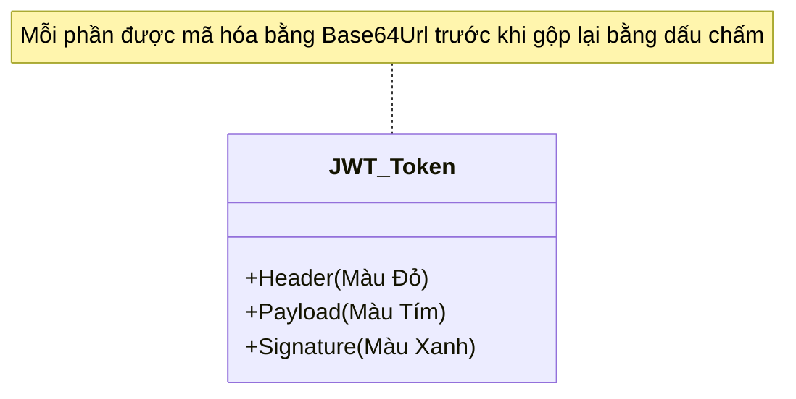

# SỔ TAY TỰ HỌC: CƠ CHẾ HOẠT ĐỘNG CỦA JWT (JSON WEB TOKEN) TRONG WEB API

> Tài liệu này giải thích chi tiết bản chất của **JWT (JSON Web Token)** - phương pháp xác thực không trạng thái (Stateless) tiêu chuẩn trong lập trình Web API hiện đại. Tài liệu sử dụng các ví dụ thực tế và giải thích chi tiết từng thành phần để bạn dễ dàng nắm bắt.

---

## 📅 MỤC LỤC
1. [Phần 1: Tại sao phải dùng JWT? (So sánh Session vs Token)](#phần-1-tại-sao-phải-dùng-jwt-so-sánh-session-vs-token)
2. [Phần 2: Cấu trúc 3 phần của một JWT Token](#phần-2-cấu-trúc-3-phần-của-một-jwt-token)
3. [Phần 3: Quy trình hoạt động của JWT Flow (Sơ đồ Sequence)](#phần-3-quy-trình-hoạt-động-của-jwt-flow-sơ-đồ-sequence)
4. [Phần 4: Khái niệm "Claims" là gì? (Các thông tin găm vào Vé)](#phần-4-khái-niệm-claims-là-gì-các-thông-tin-găm-vào-vé)
5. [Phần 5: Các nguyên tắc bảo mật tối quan trọng khi dùng JWT](#phần-5-các-nguyên-tắc-bảo-mật-tối-quan-trọng-khi-dùng-jwt)
6. [Phần 6: Cách kiểm tra (Debug) Token trực quan](#phần-6-cách-kiểm-tra-debug-token-trực-quan)

---

## PHẦN 1: TẠI SAO PHẢI DÙNG JWT? (SO SÁNH SESSION VS TOKEN)

Trước khi có Token, các hệ thống web truyền thống sử dụng **Session & Cookie**. Hãy so sánh chúng bằng ẩn dụ thực tế để thấy sự vượt trội của JWT:

### 1. Cơ chế Session & Cookie (Stateful - Lưu trạng thái)
*   **Ẩn dụ:** Bạn gửi đồ ở siêu thị, nhân viên ghi thông tin của bạn vào **Sổ tay gửi đồ** ở quầy và đưa cho bạn **Thẻ số 12**. Mỗi lần bạn muốn lấy đồ hoặc cất thêm đồ, nhân viên phải giở sổ tay ra đối chiếu xem Thẻ số 12 là của ai.
*   **Điểm yếu:**
    *   **Tốn tài nguyên:** Server phải lưu trữ thông tin tất cả các Session đang đăng nhập vào RAM hoặc Database. Nếu có 1 triệu người online cùng lúc, server sẽ cạn kiệt bộ nhớ.
    *   **Khó mở rộng (Scaling):** Nếu hệ thống chạy trên 3 Server khác nhau. Bạn đăng nhập ở Server 1 (lưu session ở Server 1). Lượt gọi tiếp theo của bạn nhảy vào Server 2, Server 2 không có cuốn sổ tay đó nên sẽ bắt bạn đăng nhập lại.

### 2. Cơ chế JWT (Stateless - Không lưu trạng thái)
*   **Ẩn dụ:** Bạn đăng nhập thành công, Server in cho bạn một **Thẻ Thành Viên VIP** tự động. Trên thẻ ghi rõ tên, ngày hết hạn và có **Chữ ký chìm đặc biệt** của giám đốc. Bạn tự giữ tấm thẻ đó bên mình. Mỗi lần gọi API, bạn chỉ cần chìa thẻ ra. Server chỉ cần kiểm tra chữ ký trên thẻ có đúng của giám đốc không. Nếu đúng, Server phục vụ bạn ngay lập tức.
*   **Ưu điểm:**
    *   **Server rảnh tay:** Server hoàn toàn **không cần lưu** bất kỳ thông tin session nào vào bộ nhớ RAM hay DB.
    *   **Dễ mở rộng:** Cả 3 Server chỉ cần dùng chung 1 "Chữ ký bí mật" (Secret Key). Bất kể request của bạn nhảy vào server nào, server đó cũng có thể tự xác thực tấm thẻ của bạn độc lập mà không cần hỏi server khác.

---

## PHẦN 2: CẤU TRÚC 3 PHẦN CỦA MỘT JWT TOKEN

Một chuỗi JWT trông sẽ như thế này (gồm 3 đoạn văn bản được ngăn cách nhau bởi 2 dấu chấm `.`):

`xxxxx.yyyyy.zzzzz`

Khi giải mã, 3 phần này tương ứng với:



### 1. Header (Phần Đầu) - Thông tin kỹ thuật
Chứa kiểu token (mặc định là JWT) và thuật toán mã hóa được sử dụng để ký (ví dụ: HS256).
```json
{
  "alg": "HS256",
  "typ": "JWT"
}
```

### 2. Payload (Phần Thân) - Dữ liệu của User (Claims)
Đây là phần chứa thông tin bạn muốn đính kèm vào Token (Ví dụ: ID người dùng, Tên, Quyền hạn).
```json
{
  "nameid": "12",
  "unique_name": "admin",
  "role": "Admin",
  "exp": 1719333600
}
```
*   ⚠️ **LƯU Ý CỰC KỲ QUAN TRỌNG:** Phần Payload này chỉ được mã hóa dạng **Base64** chứ không phải mã hóa bảo mật. Bất kỳ ai cũng có thể giải mã phần này dễ dàng để đọc thông tin bên trong. **Vì vậy, không bao giờ được để các thông tin nhạy cảm như Mật khẩu, Số thẻ tín dụng vào Payload!**

### 3. Signature (Phần Chữ ký) - Lưới bảo vệ chống sửa đổi
Đây là phần quan trọng nhất để đảm bảo tính toàn vẹn của Token.
Nó được tạo ra bằng cách lấy: `Mã hóa_Base64(Header)` + `Mã hóa_Base64(Payload)` đem đi băm (Hash) chung với một **Chuỗi khóa bí mật (Secret Key)** được lưu độc quyền trên Server.

*   **Tại sao lại an toàn:** Nếu hacker cố tình sửa tên user trong phần Payload từ `"customer"` thành `"admin"` để chiếm quyền, chữ ký (`Signature`) được tính toán lại sẽ không khớp với chữ ký ban đầu của Server (vì hacker không biết Secret Key của Server). Server sẽ lập tức phát hiện token bị giả mạo và từ chối xử lý (HTTP 401).

---

## PHẦN 3: QUY TRÌNH HOẠT ĐỘNG CỦA JWT FLOW

Dưới đây là sơ đồ chi tiết vòng đời từ lúc Login lấy Token đến các lượt gọi API tiếp theo:

```mermaid
sequenceDiagram
    autonumber
    actor FE as Client (Front-end)
    participant BE as Server (Web API)
    database DB as SQL Server (Database)

    FE->>BE: 1. Đăng nhập (Gửi Username/Password)
    BE->>DB: 2. Kiểm tra thông tin tài khoản
    DB-->>BE: 3. Khớp thông tin đăng nhập đúng
    Note over BE: Dùng Secret Key ký và đóng gói JWT Token
    BE-->>FE: 4. Trả về JWT Token (Chuỗi xxxxx.yyyyy.zzzzz)
    Note over FE: Frontend lưu Token vào LocalStorage hoặc Cookie
    
    Note over FE: Lượt gọi API tiếp theo (ví dụ: lấy thông tin giỏ hàng)
    FE->>BE: 5. Gửi Request + Authorization Header [Bearer Token]
    Note over BE: Đọc Token từ Header, kiểm tra Chữ ký (Signature) bằng Secret Key
    alt Chữ ký đúng & Token còn hạn
        BE-->>FE: 6a. Trả dữ liệu giỏ hàng thành công (HTTP 200)
    else Chữ ký sai hoặc hết hạn
        BE-->>FE: 6b. Trả về lỗi Không có quyền (HTTP 401 Unauthorized)
    end
```

---

## PHẦN 4: KHÁI NIỆM "CLAIMS" LÀ GÌ?

Trong JWT, **Claim** nghĩa là một **"Lời khẳng định"** về một đối tượng (User). Nó là các cặp `Key-Value` nằm trong phần Payload để mô tả về User đó.

### Có 2 loại Claims thông dụng:

1.  **Registered Claims (Các claims tiêu chuẩn quốc tế):**
    Được khuyến nghị sử dụng để các hệ thống hiểu nhau thống nhất:
    *   `sub` (Subject): Định danh của User (thường là User ID).
    *   `exp` (Expiration Time): Thời điểm token hết hiệu lực (dạng Unix timestamp).
    *   `iss` (Issuer): Đơn vị phát hành token.
    *   `aud` (Audience): Đối tượng sử dụng token (Frontend nhận diện).
2.  **Custom Claims (Do bạn tự định nghĩa thêm):**
    Bạn có thể thêm bất kỳ cặp Key-Value nào tùy nhu cầu:
    *   `role`: Quyền hạn của user (`"Admin"`, `"Customer"`). Dựa vào đây để bảo vệ API bằng attribute `[Authorize(Roles = "Admin")]`.
    *   `displayName`: Tên hiển thị của người dùng để Frontend đỡ phải gọi thêm API lấy tên.

---

## PHẦN 5: CÁC NGUYÊN TẮC BẢO MẬT TỐI QUAN TRỌNG KHI DÙNG JWT

Khi tự tay cấu hình JWT sắp tới, bạn bắt buộc phải tuân thủ các nguyên tắc sau:

1.  **Secret Key phải đủ dài và phức tạp:**
    Khóa bí mật dùng để ký token phải dài ít nhất **256-bit (32 ký tự trở lên)**. Nếu khóa quá ngắn, hacker có thể dùng các máy tính mạnh để đoán mò (brute-force) ra khóa của bạn.
2.  **Thiết lập thời gian hết hạn (Expiration Time) hợp lý:**
    Không bao giờ tạo Token vô hạn. Thông thường, token truy cập (Access Token) chỉ nên có hạn từ **15 phút đến vài tiếng**. Nếu lỡ bị lộ token, hacker cũng chỉ sử dụng được trong một khoảng thời gian ngắn.
3.  **Sử dụng HTTPS:**
    Bắt buộc phải mã hóa đường truyền bằng SSL/HTTPS để ngăn chặn việc hacker nghe lén đường truyền mạng (Man-in-the-middle attack) để chôm token.
4.  **Không lưu thông tin nhạy cảm vào Payload:**
    Như đã nói ở Phần 2, Payload có thể bị giải mã ngược lại rất dễ dàng bằng các công cụ online.

---

## PHẦN 6: CÁCH KIỂM TRA (DEBUG) TOKEN TRỰC QUAN

Khi viết xong API đăng nhập trả về Token, bạn có thể thực hiện kiểm tra thủ công xem cấu trúc bên trong Token có đúng ý mình không bằng cách:

1.  Truy cập trang web: [https://jwt.io/](https://jwt.io/) (Trang web kiểm tra JWT tiêu chuẩn thế giới).
2.  Dán chuỗi Token của bạn vào ô **Encoded**.
3.  Trang web sẽ lập tức giải mã hiển thị:
    *   Phần **Header** (Màu đỏ).
    *   Phần **Payload** (Màu tím - Bạn sẽ thấy rõ ID, Username, Roles mình truyền vào).
    *   Bạn có thể điền Secret Key của mình vào ô **Verify Signature** để kiểm tra xem chữ ký của Token đó có hợp lệ hay không.
