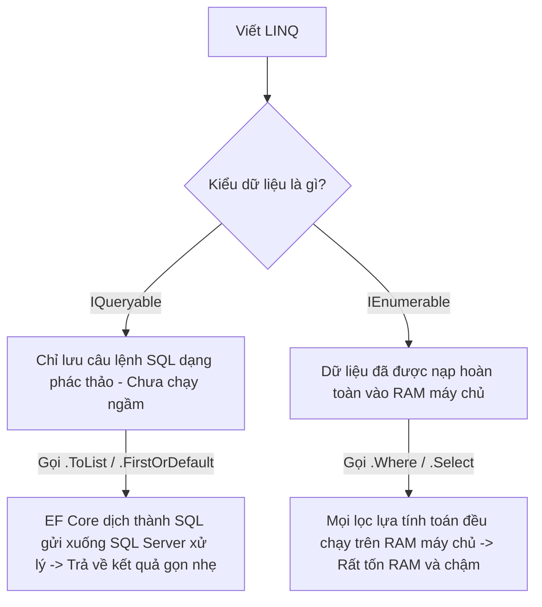

# SỔ TAY TỰ HỌC: LÀM CHỦ LINQ TRONG C# & EF CORE (CHI TIẾT TỪ A - Z)

> Tài liệu này hướng dẫn chi tiết về **LINQ (Language Integrated Query)** - công cụ tối quan trọng trong C# để truy vấn và xử lý dữ liệu. Tài liệu được thiết kế trực quan, giải thích rõ các kiểu trả về và cách ứng dụng thực tế trong dự án **Artify eCommerce**.

---

## 📅 MỤC LỤC
1. [Phần 1: LINQ là gì? Ẩn dụ thực tế "Chọn hàng siêu thị"](#phần-1-linq-là-gì-ẩn-dụ-thực-tế-chọn-hàng-siêu-thị)
2. [Phần 2: Hai kiểu viết LINQ (Method Syntax vs Query Syntax)](#phần-2-hai-kiểu-viết-linq-method-syntax-vs-query-syntax)
3. [Phần 3: Các hàm LINQ thông dụng, Cú pháp & Kiểu trả về](#phần-3-các-hàm-linq-thông-dụng-cú-pháp--kiểu-trả-về)
4. [Phần 4: Điểm khác biệt cực kỳ quan trọng: IQueryable vs IEnumerable](#phần-4-điểm-khác-biệt-cực-kỳ-quan-trọng-iqueryable-vs-ienumerable)
5. [Phần 5: Các hàm Bất đồng bộ (Async) của EF Core](#phần-5-các-hàm-bất-đồng-bộ-async-của-ef-core)
6. [Phần 6: Những sai lầm kinh điển cần tránh](#phần-6-những-sai-lầm-kinh-điển-cần-tránh)

---

## PHẦN 1: LINQ LÀ GÌ? ẨN DỤ THỰC TẾ "CHỌN HÀNG SIÊU THỊ"

**LINQ (Language Integrated Query)** là bộ công cụ tích hợp sẵn trong C# giúp bạn viết các câu lệnh truy vấn dữ liệu (từ Database, List, Array, XML...) bằng chính ngôn ngữ C# thay vì phải viết các câu lệnh SQL thô cứng dạng chuỗi.

### Ẩn dụ về "Chọn hàng siêu thị":
Hãy tưởng tượng Database là một siêu thị khổng lồ chứa hàng triệu mặt hàng. Bạn cầm một chiếc giỏ mua hàng và thực hiện các hành động sau:
*   **Hành động 1:** "Tôi muốn lấy tất cả các lon nước ngọt có ga" $\rightarrow$ Đây là lọc dữ liệu (**`Where`**).
*   **Hành động 2:** "Tôi chỉ muốn lấy cái giá tiền của lon Coca đó thôi" $\rightarrow$ Đây là chọn trường cụ thể (**`Select`**).
*   **Hành động 3:** "Sắp xếp giỏ hàng từ rẻ nhất đến đắt nhất" $\rightarrow$ Đây là sắp xếp (**`OrderBy`**).
*   **Hành động 4:** "Lấy duy nhất lon sữa đầu tiên trên kệ" $\rightarrow$ Đây là lấy một phần tử (**`FirstOrDefault`**).

---

## PHẦN 2: HAI KIỂU VIẾT LINQ

Trong C#, bạn có hai cách viết câu lệnh LINQ:

### 1. Method Syntax (Cú pháp phương thức - Khuyên dùng 🌟)
Sử dụng các phương thức mở rộng (Extension Methods) nối tiếp nhau bằng dấu chấm `.`. Đây là cách viết phổ biến, hiện đại và được sử dụng rộng rãi nhất trong các dự án thực tế.
```csharp
var users = _context.Accounts
    .Where(x => x.Email.Contains("@gmail.com"))
    .OrderBy(x => x.CreatedAt)
    .ToList();
```

### 2. Query Syntax (Cú pháp truy vấn)
Có cấu trúc gần giống như câu lệnh SQL truyền thống.
```csharp
var users = (from x in _context.Accounts
             where x.Email.Contains("@gmail.com")
             orderby x.CreatedAt
             select x).ToList();
```
*   **Lời khuyên:** Hãy tập trung học và sử dụng **Method Syntax** vì nó dễ đọc, dễ viết nối chuỗi, và hầu hết các thư viện C# đều tối ưu cho cú pháp này.

---

## PHẦN 3: CÁC HÀM LINQ THÔNG DỤNG, CÚ PHÁP & KIỂU TRẢ VỀ

Dưới đây là bảng tổng hợp chi tiết các hàm LINQ bạn sẽ dùng hàng ngày khi lập trình Backend:

### 1. Nhóm Lọc dữ liệu (Filtering)

| Tên Hàm | Ý nghĩa | Kiểu trả về | Ví dụ thực tế |
| :--- | :--- | :--- | :--- |
| **`Where`** | Lọc danh sách thỏa mãn điều kiện. | `IQueryable<T>` hoặc `IEnumerable<T>` | `_context.Accounts.Where(x => x.IsActive == true)` |
| **`FirstOrDefault`** | Lấy phần tử đầu tiên thỏa mãn điều kiện. Nếu không thấy, trả về `null`. | `T?` (Có thể Null) | `_context.Accounts.FirstOrDefault(x => x.Id == 5)` |
| **`SingleOrDefault`** | Lấy phần tử duy nhất thỏa mãn điều kiện. Ném ra lỗi (Crash) nếu tìm thấy **nhiều hơn 1** phần tử khớp. Nếu không thấy, trả về `null`. | `T?` (Có thể Null) | `_context.Accounts.SingleOrDefault(x => x.Email == "test@gmail.com")` |
| **`Any`** | Kiểm tra xem danh sách có chứa phần tử nào thỏa mãn điều kiện không. | `bool` (`true` / `false`) | `_context.Accounts.Any(x => x.Username == "admin")` |
| **`All`** | Kiểm tra xem **tất cả** phần tử trong danh sách có thỏa mãn điều kiện không. | `bool` | `_context.Accounts.All(x => x.Age >= 18)` |

---

### 2. Nhóm Biến đổi dữ liệu (Projection)

| Tên Hàm | Ý nghĩa | Kiểu trả về | Ví dụ thực tế |
| :--- | :--- | :--- | :--- |
| **`Select`** | Chọn các cột cần lấy, hoặc biến đổi đối tượng từ kiểu này sang kiểu khác (ví dụ: chuyển từ Entity sang DTO). | `IQueryable<ResultType>` | `_context.Accounts.Select(x => new UserDto { Id = x.Id, Username = x.Username })` |

---

### 3. Nhóm Sắp xếp (Sorting)

| Tên Hàm | Ý nghĩa | Kiểu trả về | Ví dụ thực tế |
| :--- | :--- | :--- | :--- |
| **`OrderBy`** | Sắp xếp tăng dần theo cột chỉ định. | `IOrderedQueryable<T>` | `_context.Accounts.OrderBy(x => x.CreatedAt)` |
| **`OrderByDescending`**| Sắp xếp giảm dần theo cột chỉ định. | `IOrderedQueryable<T>` | `_context.Accounts.OrderByDescending(x => x.CreatedAt)` |
| **`ThenBy`** | Sắp xếp phụ (dùng ngay sau `OrderBy` nếu có trùng lặp dữ liệu cần xếp tiếp). | `IOrderedQueryable<T>` | `_context.Accounts.OrderBy(x => x.FullName).ThenBy(x => x.CreatedAt)` |

---

### 4. Nhóm Phân trang (Paging)

| Tên Hàm | Ý nghĩa | Kiểu trả về | Ví dụ thực tế |
| :--- | :--- | :--- | :--- |
| **`Skip(n)`** | Bỏ qua `n` phần tử đầu tiên. | `IQueryable<T>` | `_context.Accounts.Skip(10)` |
| **`Take(m)`** | Lấy ra tối đa `m` phần tử tiếp theo. | `IQueryable<T>` | `_context.Accounts.Take(5)` |

*   👉 **Ứng dụng làm Phân trang (Pagination) API:**
    Nếu mỗi trang hiển thị 10 phần tử, muốn lấy dữ liệu của trang số 3:
    `var pageData = _context.Accounts.Skip((3 - 1) * 10).Take(10).ToList();` (Bỏ qua 20 dòng đầu, lấy 10 dòng kế tiếp).

---

### 5. Nhóm Tính toán gom cụm (Aggregation)

| Tên Hàm | Ý nghĩa | Kiểu trả về | Ví dụ thực tế |
| :--- | :--- | :--- | :--- |
| **`Count`** | Đếm tổng số lượng phần tử. | `int` | `_context.Accounts.Count(x => x.IsActive)` |
| **`Sum`** | Tính tổng giá trị số. | `decimal`, `int`, v.v. | `_context.Orders.Sum(x => x.TotalAmount)` |
| **`Max` / `Min`** | Lấy giá trị lớn nhất / nhỏ nhất. | Kiểu của cột | `_context.Products.Max(x => x.Price)` |

---

## PHẦN 4: ĐIỂM KHÁC BIỆT CỰC KỲ QUAN TRỌNG: IQUERYABLE VS IENUMERABLE

Đây là câu hỏi phỏng vấn kinh điển dành cho lập trình viên .NET, ảnh hưởng trực tiếp đến hiệu năng của hệ thống Web.



### 1. `IQueryable<T>` (Truy vấn phía Database Server)
*   **Khi nào có:** Khi bạn viết LINQ truy vấn trực tiếp từ DbContext (ví dụ: `_context.Accounts.Where(...)`).
*   **Đặc điểm:** Câu lệnh **chưa được thực thi** dưới Database. Nó chỉ là một chuỗi lệnh SQL đang được xây dựng (Trì hoãn thực thi - Lazy Evaluation).
*   **Tại sao lại tốt:** Nếu bạn viết `.Where(x => x.Id > 5).Take(10)`, Entity Framework sẽ dịch toàn bộ chuỗi này thành một câu lệnh SQL duy nhất: `SELECT TOP 10 ... WHERE Id > 5` rồi gửi xuống SQL Server chạy. Server chỉ trả về đúng 10 bản ghi qua mạng.

### 2. `IEnumerable<T>` (Xử lý trên RAM của Web Server)
*   **Khi nào có:** Khi bạn ép kiểu dữ liệu từ DB về bộ nhớ (bằng cách dùng `.ToList()`, `.ToArray()`) hoặc xử lý trên List/Array trong C#.
*   **Đặc điểm:** Dữ liệu đã được tải hoàn toàn về RAM của Web Server.
*   **Tại sao cần lưu ý:** Nếu bạn viết:
    `var list = _context.Accounts.ToList().Where(x => x.Id > 5);`
    Hệ thống sẽ chạy câu lệnh `SELECT * FROM Account` để tải toàn bộ hàng triệu dòng dữ liệu từ SQL Server về RAM của Web, sau đó mới dùng C# lọc lấy các tài khoản có `Id > 5`. Việc này cực kỳ tốn RAM và làm chậm ứng dụng.

---

## PHẦN 5: CÁC HÀM BẤT ĐỒNG BỘ (ASYNC) CỦA EF CORE

Khi làm việc với cơ sở dữ liệu trong Web API, bạn luôn phải sử dụng các phiên bản bất đồng bộ của LINQ được cung cấp bởi Entity Framework Core. Các hàm này đều kết thúc bằng đuôi **`Async`**:

*   **Yêu cầu bắt buộc:** Phải thêm dòng `using Microsoft.EntityFrameworkCore;` ở đầu file.
*   **Các cặp hàm đồng bộ - bất đồng bộ tương ứng:**

| Hàm Đồng bộ (Chạy Sync - Block Thread) | Hàm Bất đồng bộ (Chạy Async - Non-blocking) |
| :--- | :--- |
| `ToList()` | `await ToListAsync()` |
| `FirstOrDefault(...)` | `await FirstOrDefaultAsync(...)` |
| `SingleOrDefault(...)` | `await SingleOrDefaultAsync(...)` |
| `Any(...)` | `await AnyAsync(...)` |
| `Count(...)` | `await CountAsync(...)` |

**Quy tắc vàng:** Luôn dùng `await` trước các hàm bất đồng bộ.

---

## PHẦN 6: NHỮNG SAI LẦM KINH ĐIỂN CẦN TRÁNH

### 1. Gọi `.ToList()` quá sớm
```csharp
// SAI: Tải toàn bộ bảng Accounts về RAM rồi mới lọc những người có Email Gmail
var users = _context.Accounts.ToList().Where(x => x.Email.Contains("@gmail.com"));

// ĐÚNG: Lọc ở SQL Server trước, chỉ lấy những người thỏa mãn về RAM
var users = await _context.Accounts.Where(x => x.Email.Contains("@gmail.com")).ToListAsync();
```

### 2. Nhầm lẫn giữa `FirstOrDefault` và `SingleOrDefault`
*   Dùng `FirstOrDefault` khi bạn chỉ quan tâm lấy ra bất kỳ phần tử nào đầu tiên khớp điều kiện (Ví dụ: Lấy sản phẩm mới nhất).
*   Chỉ dùng `SingleOrDefault` khi bạn chắc chắn trong DB **chỉ được phép có duy nhất 1 bản ghi khớp** (Ví dụ: Tìm theo ID, tìm theo Email duy nhất). Nếu DB bị lỗi trùng 2 Email, `SingleOrDefault` sẽ ném lỗi Crash hệ thống ngay để báo động.

### 3. Quên kiểm tra `null` khi dùng `FirstOrDefault`
Hàm `FirstOrDefault` trả về đối tượng hoặc `null` nếu không tìm thấy. Nếu bạn trực tiếp truy cập thuộc tính mà không check null, ứng dụng sẽ bị crash lỗi `NullReferenceException`.
```csharp
var user = await _context.Accounts.FirstOrDefaultAsync(x => x.Username == "xyz");

// SAI (Nếu không có user xyz, dòng này sẽ gây lỗi Crash chương trình)
string name = user.FullName; 

// ĐÚNG
if (user != null)
{
    string name = user.FullName;
}
```
