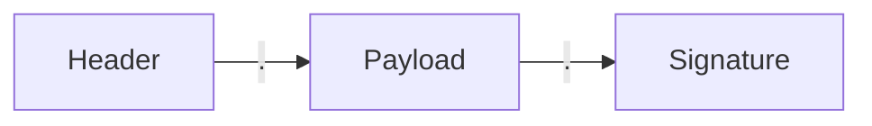
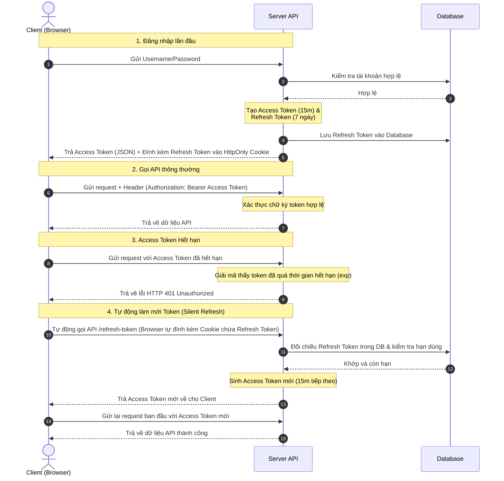

# Hướng dẫn chi tiết về JWT & Refresh Token trong ASP.NET Core

Tài liệu này giải thích chi tiết cơ chế hoạt động, cấu trúc, luồng chạy thực tế và các phương pháp bảo mật tối ưu khi áp dụng bộ đôi **Access Token (JWT)** & **Refresh Token** trong ứng dụng REST API.

---

## 1. Khái niệm cơ bản

### 1.1. JWT (JSON Web Token) là gì?
JWT là một định danh chuẩn hóa dưới dạng chuỗi mã hóa an toàn dùng để truyền tải thông tin giữa Client và Server dưới dạng một đối tượng JSON. Thông tin này có thể được xác minh và tin cậy vì nó chứa **Chữ ký số (Signature)**.

### 1.2. Access Token là gì?
*   Là một chuỗi JWT ngắn hạn (thường sống từ 5 - 15 phút).
*   Được gửi kèm trong **mỗi HTTP Request** (thông qua header `Authorization: Bearer <Access_Token>`) để chứng minh danh tính và quyền truy cập vào các tài nguyên bảo mật.

### 1.3. Refresh Token là gì?
*   Là một chuỗi ngẫu nhiên dài hạn (thường sống từ 7 - 30 ngày).
*   Được lưu trữ an toàn trong Database của Server và lưu ở Cookie của Client.
*   **Mục đích duy nhất**: Dùng để đổi lấy một Access Token mới khi Access Token cũ hết hạn mà không bắt người dùng phải đăng nhập lại bằng Username/Password.

---

## 2. Cấu trúc của JWT
Một token JWT bao gồm 3 phần được phân tách bằng dấu chấm (`.`): `Header.Payload.Signature`



### 2.1. Header (Phần đầu)
Chứa thông tin metadata của token gồm loại token (`typ`) và thuật toán ký số (`alg`), ví dụ: `HS256` (HMAC SHA-256).
```json
{
  "alg": "HS256",
  "typ": "JWT"
}
```

### 2.2. Payload (Phần thân chứa các Claims)
Chứa thông tin của đối tượng (User). Các thông tin này được gọi là các **Claims** (lời khẳng định):
```json
{
  "http://schemas.xmlsoap.org/ws/2005/05/identity/claims/nameidentifier": "1",
  "http://schemas.xmlsoap.org/ws/2005/05/identity/claims/name": "Nguyễn Văn A",
  "http://schemas.microsoft.com/ws/2008/06/identity/claims/role": "User",
  "exp": 1782384800,
  "iss": "ArtifyIssuer",
  "aud": "ArtifyAudience"
}
```
> [!WARNING]
> Phần Payload này chỉ được mã hóa dạng **Base64Url** chứ không được che giấu bí mật. Bất cứ ai có token cũng có thể giải mã để đọc nội dung. Vì vậy, **tuyệt đối không để mật khẩu hoặc thông tin nhạy cảm ở đây**.

### 2.3. Signature (Chữ ký số)
Dùng để xác thực tính toàn vẹn của token (chống giả mạo). Được tạo ra bằng cách lấy chuỗi mã hóa của Header + Payload băm với một khóa bí mật (`Secret Key`) chỉ Server biết:
```text
HMACSHA256(
  base64UrlEncode(header) + "." +
  base64UrlEncode(payload),
  SecretKey
)
```

---

## 3. Luồng hoạt động chi tiết (Workflow)



---

## 4. Cơ chế Bảo mật và Lưu trữ tối ưu

### 4.1. Tại sao cần lưu Refresh Token vào HttpOnly Cookie?
*   **Chống tấn công XSS (Cross-Site Scripting)**: Khi bật cờ `HttpOnly = true`, mã độc JavaScript không thể đọc được cookie này. Hacker không thể dùng lệnh `document.cookie` để lấy trộm Refresh Token.
*   **Tự động gửi kèm**: Trình duyệt sẽ tự động gửi cookie này lên Server bất cứ khi nào ứng dụng gọi API `/refresh-token` mà Frontend không cần viết code đính kèm thủ công.

### 4.2. Tại sao phải lưu Refresh Token vào Database?
*   **Tính năng Đăng xuất (Logout)**: JWT là stateless, không thể thu hồi trước khi hết hạn. Nếu muốn đăng xuất ngay lập tức, Server chỉ cần xóa/vô hiệu hóa Refresh Token trong Database. Khi đó, cookie dù còn hạn cũng sẽ bị từ chối.
*   **Khóa tài khoản khẩn cấp**: Khi Admin khóa tài khoản của người dùng, Server sẽ xóa toàn bộ Refresh Token của user đó trong DB, buộc người dùng bị đăng xuất ngay lập tức ở lần refresh tiếp theo.

### 4.3. Xử lý khi Frontend và Backend khác Domain (Cross-Origin)
Để trình duyệt cho phép truyền nhận cookie chéo site an toàn:
1.  **CORS**: Cấu hình phía Server cho phép tên miền của Frontend được truyền thông tin xác thực (`.AllowCredentials()`).
2.  **Frontend**: Cấu hình HTTP Client (Axios/Fetch) luôn gửi kèm credentials (`withCredentials: true` hoặc `credentials: 'include'`).
3.  **SameSite**: 
    *   **SameSite = SameSiteMode.Lax**: Phù hợp khi Frontend và Backend cùng chạy trên localhost hoặc chung tên miền cha (ví dụ: `app.artify.com` và `api.artify.com`).
    *   **SameSite = SameSiteMode.None**: Bắt buộc khi Frontend và Backend khác hoàn toàn tên miền (ví dụ: `myfrontend.com` và `myapi.com`). Đi kèm với `Secure = true` (chạy trên HTTPS).

---

## 5. So sánh Luồng Kiểm tra

| Yêu cầu kiểm tra | Access Token (JWT) | Refresh Token |
| :--- | :--- | :--- |
| **Khi nào kiểm tra?** | Mỗi khi có bất kỳ request API nào gửi lên. | Chỉ khi Access Token hết hạn và cần cấp mới. |
| **Cách Server kiểm tra?** | Giải mã toán học tại chỗ (Stateless), kiểm tra chữ ký và hạn dùng. **Không cần truy vấn Database**. | Nhận từ cookie và thực hiện **truy vấn Database** để tìm dòng tương ứng xem có trùng khớp và còn hiệu lực không. |
| **Quyền hạn truy cập** | Cung cấp thông tin xác định User là ai, có quyền Role gì (`[Authorize]`). | Chỉ đóng vai trò như một "chìa khóa phụ" để xin cấp khóa chính mới, không dùng để phân quyền trực tiếp. |
