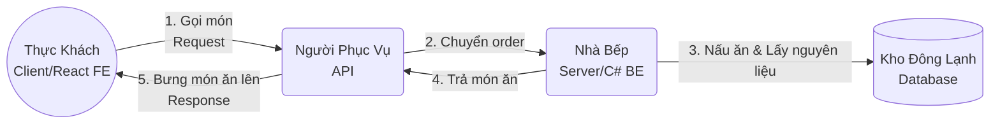

# Bài Giảng Trực Quan: Tìm Hiểu REST API & Các Phương Thức HTTP Tiêu Chuẩn

Chào mừng bạn đến với bài học về **REST API**. Tài liệu này được thiết kế như một bài giảng bài bản, giúp bạn đi từ những khái niệm đời thường nhất đến việc thiết kế API chuẩn công nghiệp phục vụ cho dự án thực tế.

---

# PHẦN 1: BÀI GIẢNG ĐẠI CƯƠNG - REST API LÀ GÌ?

## 1.1. Ví Dụ Đời Thường: "Câu Chuyện Ở Nhà Hàng"

Để hiểu API và REST API, hãy tưởng tượng bạn đi ăn tại một nhà hàng:



* **Thực khách (Client / Front-end / React JS):** Là bạn. Bạn muốn lấy dữ liệu (món ăn) nhưng không thể tự đi vào bếp để nấu hay lục lọi kho lạnh. Bạn ngồi ở bàn và nhìn vào **Thực đơn (API Specification)**.
* **Nhà bếp (Server / Back-end / ASP.NET Core):** Là nơi lưu giữ logic nấu ăn, xử lý dữ liệu và có quyền truy cập vào **Kho đông lạnh (Database)**.
* **Người phục vụ (API - Application Programming Interface):** Là cầu nối. Người phục vụ nhận order của bạn, chuyển vào nhà bếp, đợi nhà bếp nấu xong rồi bưng món ăn ra cho bạn. Bạn không cần biết nhà bếp nấu thế nào, bạn chỉ cần giao tiếp với người phục vụ.

> **Vậy REST API là gì?**
> **REST** (Representational State Transfer) chính là **"Nội quy của nhà hàng"**. Nó quy định thực đơn phải được viết như thế nào, người phục vụ phải mặc đồ ra sao, và cách bưng bê món ăn phải theo chuẩn nào để thực khách từ bất kỳ quốc gia nào bước vào nhà hàng cũng đều hiểu và gọi món được.

---

## 1.2. Định Nghĩa Học Thuật (Nhưng Dễ Hiểu)

**REST** là viết tắt của **Representational State Transfer** (Chuyển đổi trạng thái biểu diễn). Nó là một phong cách kiến trúc thiết kế hệ thống mạng dựa trên các tài nguyên (Resources).

* **Resource (Tài nguyên):** Mọi đối tượng trong phần mềm của bạn đều là tài nguyên. Ví dụ: một tài khoản (`Account`), một sản phẩm (`Product`), một đơn hàng (`Order`), hay một bức ảnh.
* **URI / URL (Đường dẫn định danh):** Mỗi tài nguyên trên Server phải có một địa chỉ định danh duy nhất (dạng danh từ số nhiều).
  * Ví dụ: `/api/products` (Tài nguyên sản phẩm), `/api/accounts` (Tài nguyên tài khoản).
* **Representation (Biểu diễn trạng thái):** Server sẽ trả dữ liệu của tài nguyên đó về cho Client dưới dạng một "bản biểu diễn" - thông thường nhất hiện nay là định dạng **JSON**.

---

## 1.3. 5 Nguyên Tắc Cốt Lõi Để Được Gọi Là "RESTful"

Để hệ thống của bạn đạt chuẩn RESTful, bạn cần tuân thủ các nguyên tắc sau:

1. **Client - Server (Tách biệt nhiệm vụ):**
   * Client (React) chỉ lo phần giao diện, trải nghiệm người dùng.
   * Server (C#) chỉ lo phần dữ liệu, bảo mật, lưu trữ database.
   * Hai bên độc lập, giao tiếp với nhau duy nhất qua các API.
2. **Stateless (Không lưu trạng thái phiên làm việc):**
   * Server **không nhớ** bạn là ai giữa các request. Mỗi một request gửi lên Server phải tự chứa đầy đủ thông tin để Server hiểu và xử lý (đó là lý do vì sao React luôn phải đính kèm JWT Token vào Header của *mọi* request gọi API).
3. **Cacheable (Khả năng bộ nhớ đệm):**
   * Dữ liệu trả về từ API (đặc biệt là GET) phải được khai báo rõ ràng xem có cho phép trình duyệt lưu tạm (cache) lại không để giảm tải cho Server và tăng tốc độ load cho Client.
4. **Layered System (Hệ thống phân lớp):**
   * Client gọi API đến Server không cần biết phía sau Server đó là gì (nó có thể đi qua API Gateway, Load Balancer, hay gọi sang các Microservices khác). Giao diện gọi API vẫn giữ nguyên không đổi.
5. **Uniform Interface (Giao diện đồng nhất):**
   * Đây là nguyên tắc quan trọng nhất. Mọi API của bạn phải dùng chung chuẩn đặt tên URL (danh từ số nhiều), các phương thức HTTP (GET, POST, PUT, DELETE) và cấu trúc dữ liệu trả về (JSON).

---

# PHẦN 2: BÀI GIẢNG CHUYÊN SÂU - CÁC PHƯƠNG THỨC HTTP TRONG REST API

Khi tương tác với tài nguyên (CRUD - Create, Read, Update, Delete), REST quy định bạn phải dùng đúng phương thức HTTP tương ứng.

```
       Đọc dữ liệu (Read)      -------->  GET
       Tạo mới (Create)        -------->  POST
       Thay thế toàn bộ (PUT)  ---.
                                  +---->  UPDATE
       Cập nhật một phần (PATCH)--'
       Xóa bỏ (Delete)         -------->  DELETE
```

---

## 2.1. GET - Đọc và Truy Xuất Dữ Liệu
* **Mục đích:** Lấy thông tin tài nguyên từ Server.
* **Hai thuộc tính quan trọng:**
  * **An Toàn (Safe):** Gọi GET không được phép làm thay đổi database (chỉ đọc).
  * **Lặp Lại (Idempotent):** Gọi GET 100 lần với cùng tham số thì kết quả trả về luôn giống nhau, không tạo ra bất kỳ tác dụng phụ nào.
* **Ví dụ thiết kế chuẩn:**
  * Lấy danh sách sản phẩm: `GET /api/products` (HTTP 200 OK)
  * Lấy chi tiết 1 sản phẩm: `GET /api/products/15` (Nếu có trả về 200, nếu không tìm thấy trả về **404 Not Found**)
  * Tìm kiếm / Phân trang: Dùng query parameter: `GET /api/products?page=2&limit=10&search=artify`

---

## 2.2. POST - Tạo Mới Tài Nguyên
* **Mục đích:** Đưa một đối tượng mới hoàn toàn vào Database.
* **Tính chất:**
  * **Không an toàn & Không lặp lại (Non-idempotent):** Mỗi lần bạn gửi POST lên là Server sẽ insert thêm 1 dòng mới vào DB. Nếu người dùng bấm click thanh toán 3 lần liên tiếp, hệ thống sẽ tạo ra 3 đơn hàng khác nhau.
* **Ví dụ thiết kế chuẩn:**
  * URL: `POST /api/products`
  * Body gửi lên: `{"name": "Tranh phong cảnh", "price": 500}`
  * HTTP Status Code trả về: **`201 Created`** (Kèm theo thông tin đối tượng vừa tạo bao gồm cả ID tự sinh dưới DB).

---

## 2.3. PUT - Cập Nhật (Thay Thế Toàn Bộ)
* **Mục đích:** Thay thế toàn bộ dữ liệu của một tài nguyên đang tồn tại bằng dữ liệu mới.
* **Tính chất:**
  * **Lặp lại (Idempotent):** Gửi đè dữ liệu mới lên bản ghi cũ 1 lần hay nhiều lần thì kết quả cuối cùng trong DB vẫn chỉ là dữ liệu mới đó.
* **Ví dụ thiết kế chuẩn:**
  * URL: `PUT /api/products/15`
  * Body bắt buộc phải gửi **đầy đủ tất cả các trường** của sản phẩm:
    ```json
    {
      "id": 15,
      "name": "Tranh phong cảnh mới",
      "price": 600,
      "photo": "landscape.jpg",
      "isActive": true
    }
    ```
    *(Cảnh báo: Nếu bạn bỏ quên trường `photo` khi gọi PUT, EF Core sẽ cập nhật trường `photo` dưới database thành NULL hoặc giá trị mặc định).*
  * Response: **`200 OK`** hoặc **`204 No Content`**.

---

## 2.4. PATCH - Cập Nhật (Một Phần)
* **Mục đích:** Bạn chỉ muốn sửa một hoặc một vài thuộc tính cụ thể của tài nguyên, các thuộc tính còn lại giữ nguyên.
* **Tính chất:** Tiết kiệm băng thông và an toàn hơn PUT vì không sợ vô tình xóa mất dữ liệu do quên truyền trường.
* **Ví dụ thiết kế chuẩn:**
  * Bạn chỉ muốn đổi giá sản phẩm 15 thành 700:
    * URL: `PATCH /api/products/15`
    * Body gửi lên: `{"price": 700}` (chỉ gửi trường cần sửa).
  * Response: **`200 OK`** hoặc **`204 No Content`**.

---

## 2.5. DELETE - Xóa Tài Nguyên
* **Mục đích:** Xóa vĩnh viễn (hoặc xóa mềm) tài nguyên khỏi database.
* **Tính chất:**
  * **Lặp lại (Idempotent):** Gọi xóa lần 1 $\rightarrow$ Trả về **200 OK** (hoặc **204 No Content**). Gọi xóa lần 2 $\rightarrow$ Trả về **404 Not Found** (vì không còn tồn tại để xóa), nhưng kết quả cuối cùng dưới DB vẫn không đổi (tài nguyên vẫn ở trạng thái đã bị xóa).
* **Ví dụ thiết kế chuẩn:**
  * URL: `DELETE /api/products/15`
  * Response: **`204 No Content`** (xóa thành công và không cần trả về gì trong body).

---

# PHẦN 3: CÁC MÃ TRẠNG THÁI HTTP (HTTP STATUS CODES) CẦN BIẾT

Hãy trả về đúng mã code dưới đây để Front-end có thể xử lý hiển thị giao diện phù hợp:

### 3.1. Nhóm Thành Công (2xx)
* **`200 OK`**: Yêu cầu xử lý thành công và có trả về dữ liệu (GET, PUT, PATCH).
* **`201 Created`**: Tạo mới thành công (chuyên dùng cho POST).
* **`204 No Content`**: Xử lý thành công nhưng không cần trả dữ liệu về (DELETE, đôi khi là PUT/PATCH).

### 3.2. Nhóm Lỗi Client (4xx)
* **`400 Bad Request`**: Dữ liệu gửi lên không đúng định dạng hoặc thiếu các trường bắt buộc (Validation Error).
* **`401 Unauthorized`**: Người dùng chưa đăng nhập, hoặc token gửi kèm bị sai/hết hạn.
* **`403 Forbidden`**: Đã đăng nhập nhưng tài khoản của người dùng không đủ quyền để truy cập (Ví dụ: Khách hàng thường cố gọi API của Admin).
* **`404 Not Found`**: Không tìm thấy tài nguyên yêu cầu (ID không tồn tại trong DB).
* **`409 Conflict`**: Xung đột dữ liệu (Ví dụ: Đăng ký một Username đã bị người khác sử dụng).

### 3.3. Nhóm Lỗi Server (5xx)
* **`500 Internal Server Error`**: Có lỗi logic phát sinh ở Backend mà bạn chưa lường trước được (lỗi crash code, mất kết nối database...).

---

# PHẦN 4: BÀI TẬP THỰC HÀNH - THIẾT KẾ HỆ THỐNG API E-COMMERCE

Hãy cùng thử thiết kế hệ thống API cho tính năng **Giỏ hàng (Cart)** và **Sản phẩm (Product)**:

| Nghiệp vụ thực tế | HTTP Method | URL chuẩn RESTful | Giải thích lựa chọn |
| :--- | :--- | :--- | :--- |
| **Xem toàn bộ sản phẩm** | `GET` | `/api/products` | Đọc dữ liệu, URL dùng danh từ số nhiều. |
| **Đăng sản phẩm mới** | `POST` | `/api/products` | Tạo mới tài nguyên sản phẩm. |
| **Đổi giá của 1 sản phẩm** | `PATCH` | `/api/products/{id}` | Cập nhật một phần (chỉ sửa cột giá). |
| **Thêm món hàng vào giỏ** | `POST` | `/api/carts` | Tạo mới một bản ghi trong giỏ hàng. |
| **Cập nhật số lượng của món hàng**| `PATCH`| `/api/carts/{id}` | Cập nhật một phần (chỉ sửa cột số lượng). |
| **Xóa món hàng khỏi giỏ** | `DELETE`| `/api/carts/{id}` | Xóa một bản ghi cụ thể. |
| **Làm trống giỏ hàng** | `DELETE`| `/api/carts` | Xóa toàn bộ giỏ hàng của user hiện tại. |
